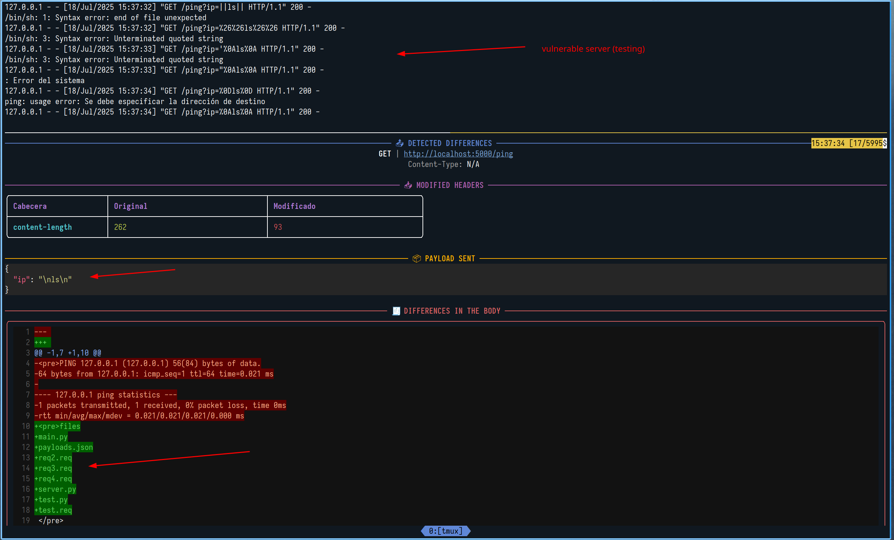

# http-fuzzer

Example: `$ python main.py --requestFile test.req --proto http --proxy http://127.0.0.1:8080 --methods GET`

`test.req`
```
GET /ping?ip=127.0.0.1 HTTP/1.1
Host: localhost:5000
User-Agent: Mozilla/5.0
Accept: */*
Connection: close


```


